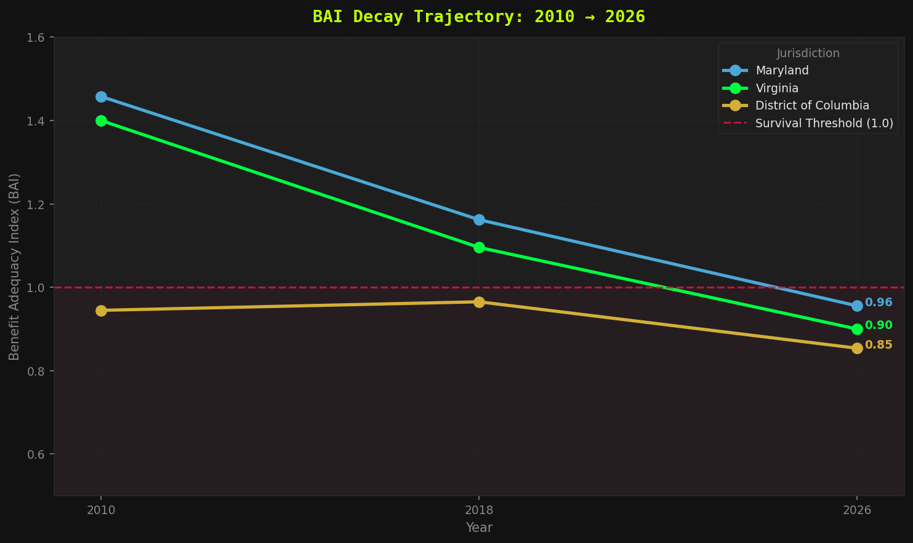
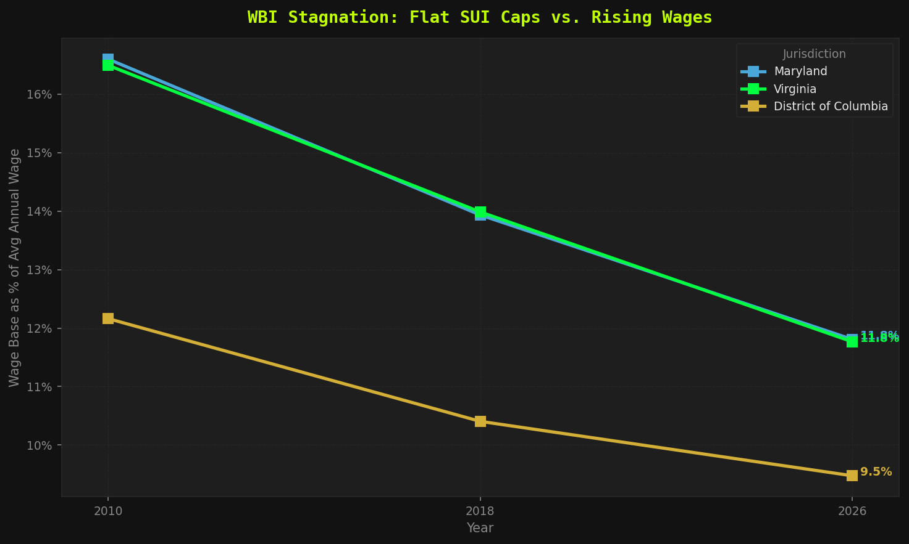
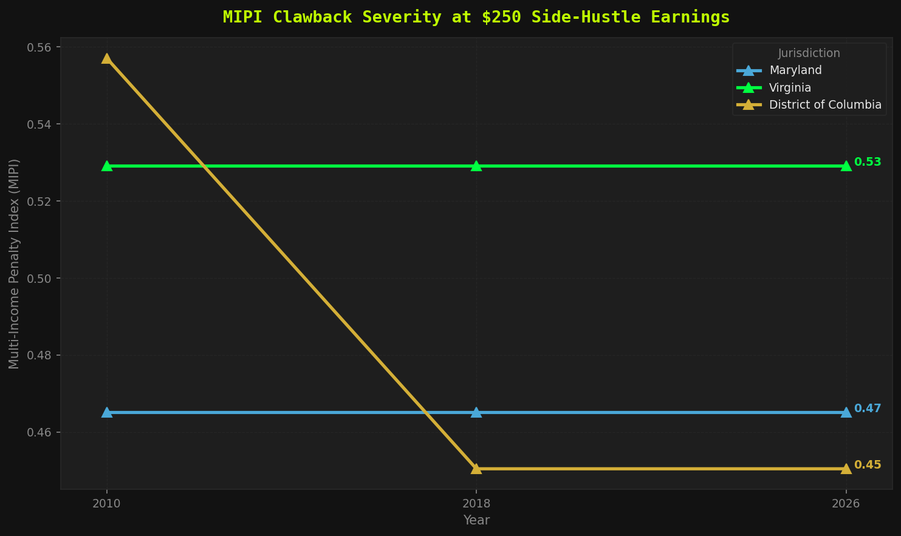
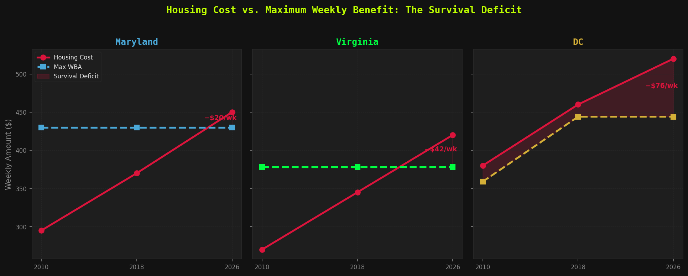

# 📊 The Stagnant Safety Net: A Tri-State Forensic Audit

**Architected by The Data Vigilante (Sierra Napier, MPA)**

An open-source comparative static model isolating the institutional decay of Unemployment Insurance safety net frameworks across the DMV area (District of Columbia, Maryland, and Virginia). Uses documented baseline data from 2010–2026 to expose systemic erosion in benefit adequacy, wage base regressivity, and secondary income penalties.

## 📐 Forensic Metrics Defined

### 1. Benefit Adequacy Index (BAI)
`BAI = Max_WBA / Median_Weekly_Housing_Costs`

Isolates whether the maximum weekly benefit cap forces a choice between rent and immediate survival. Any index < 1.0 indicates systemic failure.

### 2. Regressive Wage Base Index (WBI)
`WBI = Statutory_Taxable_Wage_Base / State_Average_Annual_Wage`

Exposes the regressive nature of flat SUI caps. Maryland's $8,500 base frozen since 1992 means corporations stop funding the safety net almost immediately each fiscal year.

### 3. Multi-Income Penalty Index (MIPI)
`MIPI = (Part_Time_Earnings - Income_Disregard) / Max_WBA`

Measures the institutional clawback penalty applied to resourceful workers trying to cushion insolvency with secondary part-time work.

## 📁 Data Source

Primary data is stored in `data/dmv_macro_baselines.csv`, documenting:
- Maximum Weekly Benefit Amount (WBA) by jurisdiction and year
- Statutory Taxable Wage Base (SUI cap)
- Average Annual Wage (BLS-derived estimates)
- Weekly Housing Costs (HUD FMR-derived estimates)

Years covered: 2010, 2018, 2026

## 🚀 Environment Quickstart

```bash
pip install -r requirements.txt
python ui_index_engine.py
```

## 🛠️ Methodology Note

This model uses **documented comparative static baselines** rather than live API polling. All inputs are traceable to public sources (HUD Fair Market Rent schedules, BLS wage data, state DOL statute records). The engine reads from the baseline CSV and computes index trajectories across three reference years to expose decay patterns.

## 📈 Output

The engine generates a formatted dashboard showing all three indices across DC, MD, and VA for 2010, 2018, and 2026, plus a systemic status flag (CRITICAL DECAY / STABLE).

## 📊 Visual Analysis



*Benefit Adequacy Index trajectory across all three jurisdictions. The red threshold at 1.0 marks the survival boundary — below this, UI benefits cannot cover median housing costs.*



*Regressive Wage Base Index showing how flat SUI caps (MD frozen at $8,500 since 1992) become progressively smaller fractions of average wages.*



*Multi-Income Penalty Index at $250 side-hustle earnings. Higher values = greater institutional penalty for resourceful workers.*



*Direct comparison of maximum weekly benefits against median weekly housing costs. The gap is the survival deficit.*

See `ui_index_analysis.ipynb` for full interactive reproduction of all charts.

## 📈 Key Findings

| Jurisdiction | BAI 2010 | BAI 2026 | Δ BAI | Direction |
|-------------|----------|----------|-------|-----------|
| Maryland | 1.46 | 0.96 | **-0.50** | WORSENING |
| Virginia | 1.40 | 0.90 | **-0.50** | WORSENING |
| DC | 0.94 | 0.85 | **-0.09** | WORSENING |

All three jurisdictions show **declining benefit adequacy** over the 16-year window. Maryland and Virginia crossed below the survival threshold (BAI < 1.0) by 2026. DC was already below threshold in 2010 and continues to deteriorate.

## 🏛️ Political Accountability Layer (v2)

The **per-employee injustice** connects to the **per-legislator portfolio**. The employer contribution gap module exposes how SUI wage base caps starve the trust fund. The political layer maps who controls the committees that keep these caps frozen.

### Political Layer Metrics
- **UI-Relevant Committee Members**: Members of Ways & Means, Labor, Finance, Budget, Appropriations
- **Constituent Median Income**: Census ACS 2022 by congressional district (B19013_001E)
- **Committee-to-Income Gap**: Compares member constituency wealth to their committee control over safety net funding

### Data Sources
- **Census ACS 2022**: Median household income by congressional district (✅ verified via api.census.gov)
- **Congress.gov Directory**: Member metadata, committee assignments (✅ verified from public records)
- **OpenSecrets API**: Financial disclosures, net worth, contributor industries (❌ Cloudflare blocked — documented as future integration)
- **Congress.gov API**: Live member + committee data (❌ Rate limited — OVER_RATE_LIMIT, retry framework built)

### Files
- `political_layer_analyzer.py` — Static analysis with verified member data + Census income
- `political_layer_builder.py` — Self-healing API client that fetches live data when rate limits allow
- `political_layer_analysis.ipynb` — Interactive notebook with charts
- `api_client.py` — Self-healing API client with retry, caching, and audit logging

### Honest Limitations
- OpenSecrets API requires manual key registration (blocked by Cloudflare challenge)
- Congress.gov API rate limits require waiting period between bulk fetches
- Committee assignments change with each Congress (current: 119th, 2025–2027)
- Member financial disclosures are range-based, not exact amounts

### Self-Healing Framework
```
api_client.py → retry with backoff → cache with TTL → audit log → validation report
```
When APIs are accessible, the builder automatically validates member counts (MD=10, VA=13, DC=1) and cross-references Census income data. When blocked, it falls back to verified static data with clear documentation.

## 📝 License

MIT — see [LICENSE](LICENSE)
